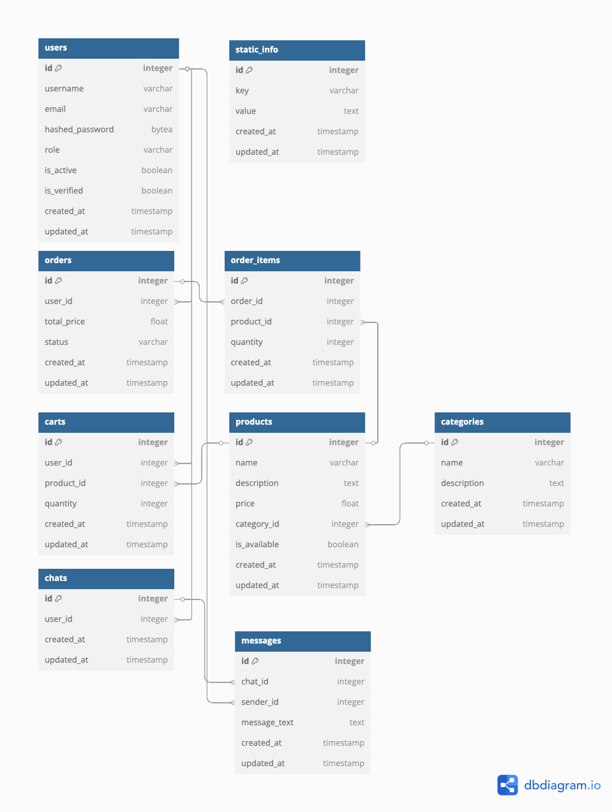

# Backend API for Coffee Shop Network

## Project Overview
This is a backend API for a coffee shop network, developed using **FastAPI**. It provides functionalities for user management, order processing, menu management, shopping cart operations, customer support chat, task scheduling, and data security measures.

## Features
- **User Management**: Registration, authentication, verification, and role-based access.
- **Order Management**: CRUD operations for customer orders.
- **Menu Management**: Categories and product handling.
- **Shopping Cart**: Adding and removing items.
- **WebSocket-based Chat**: Real-time customer support.
- **Filtering & Pagination**: Sorting, searching, and pagination for data retrieval.
- **API Documentation**: Integrated with Swagger.
- **Docker Support**: Containerized for easy deployment.
- **Task Scheduling**: Automated tasks using **scheduler** and **Taskiq**.

## Tech Stack
- **Framework**: FastAPI
- **Database**: PostgreSQL
- **Authentication**: JWT
- **WebSockets**: For customer support chat
- **Containerization**: Docker
- **Background task processing**: aio-pika, taskiq-aio-pika
- **Task scheduler**: apscheduler
- **Documentation**: Swagger

## Installation
### Prerequisites
- Python 3.9+
- PostgreSQL
- Docker (optional, for containerization)

### Steps to Run Locally
1. Clone the repository:
   ```bash
   git clone <repository-url>
   cd <project-folder>
   ```
2. Set up environment variables in `app/.env` (example `.env` file):
   ```env
   APP_CONFIG__DB__URL=postgresql+asyncpg://user:password@pg:5432/app
   
   APP_CONFIG__SMTP__HOST=host
   APP_CONFIG__SMTP__PORT=port
   APP_CONFIG__SMTP__USER=user
   APP_CONFIG__SMTP__PASSWORD=password
   
   APP_CONFIG__ADMIN__USERNAME=admin
   APP_CONFIG__ADMIN__EMAIL=admin@example.com
   APP_CONFIG__ADMIN__PASSWORD=admin
   ```
3. Generate JWT certificates:
   ```bash
   mkdir certs
   cd certs
   openssl genrsa -out jwt-private.pem 2048
   openssl rsa -in jwt-private.pem -outform PEM -pubout -out jwt-public.pem
   ```
4. Running with docker:
   ```bash
   docker-compose up --build
   ```
5. API will be available at: `http://localhost:8000`.

## API Endpoints
### Auth 
- `POST /api/v1/auth/register` - Register a new user
- `POST /api/v1/auth/login` - Get jwt
- `POST /api/v1/auth/verify` - Verify email
- `POST /api/v1/auth/resend-verification` - Resend email verification token
- `POST /api/v1/auth/refresh` - Refresh jwt

### Users
- `GET /api/v1/users/me` - Get current user informations
- `DELETE /api/v1/users/me` - Delete current user
- `PATCH /api/v1/users/me` - Update current user
- `GET /api/v1/users` - Get all users
- `GET /api/v1/users/{user_id}` - Get user by id
- `PATCH /api/v1/users/{user_id}` - Update user by id
- `DELETE /api/v1/users/{user_id}` - Delete user by id

### Categories
- `GET /api/v1/categories` - Get all categories
- `POST /api/v1/categories` - Create new category
- `GET /api/v1/categories/{category_id}` - Get category by id
- `PATCH /api/v1/categories/{category_id}` - Update category by id
- `DELETE /api/v1/categories/{category_id}` - Delete category by id

### Products
- `GET /api/v1/products` - Get all products
- `POST /api/v1/products` - Create new product
- `GET /api/v1/products/{product_id}` - Get product by id
- `PATCH /api/v1/products/{product_id}` - Update product by id
- `DELETE /api/v1/products/{product_id}` - Delete product by id

### Carts
- `GET /api/v1/carts` - Get all user carts
- `POST /api/v1/carts` - Add product to cart
- `GET /api/v1/carts/{cart_id}` - Get cart by id
- `DELETE /api/v1/carts/{cart_id}` - Delete cart by id

### Orders
- `GET /api/v1/orders` - Get all user orders
- `POST /api/v1/orders` - Create order
- `POST /api/v1/orders/all` - Get all orders
- `DELETE /api/v1/orders/{order_id}` - Delete order by id
- `PATCH /api/v1/orders/{order_id}` - Update order status

### Static Info
- `GET /api/v1/static-info` - Get all static info
- `POST /api/v1/static-info` - Create new static info
- `PATCH /api/v1/static-info/{static_info_id}` - Update static info
- `DELETE /api/v1/static-info/{static_info_id}` - Delete static info

### Chats
- `GET /api/v1/chats` - Get all chats
- `GET /api/v1/chats/{chat_id}` - Get chat by id
- `DELETE /api/v1/chats/{chat_id}` - Delete chat by id

### Messages
- `GET /api/v1/messages/{chat_id}` - Get all chat messages
- `DELETE /api/v1/messages/{chat_id}` - Delete message by id
- `PATCH /api/v1/messages/{chat_id}` - Update message by id

### WebSocket Chat
- `ws://localhost:8000/ws/chat/{user_id}`
- `ws://localhost:8000/ws/admin/{chat_id}`

### Task Scheduling
- Background tasks handled using **scheduler** and **Taskiq** for automated job execution.

### Security Features
- CSRF Protection
- XSS Protection
- SQL Injection Prevention

## Database Schema


## API Documentation
Swagger documentation available at: `http://localhost:8000/docs`